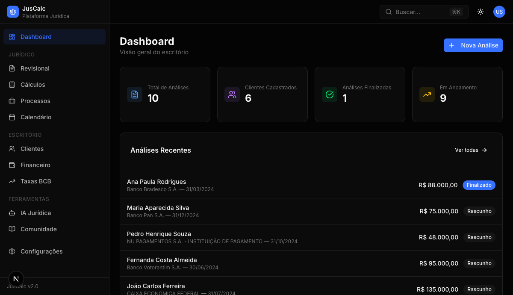
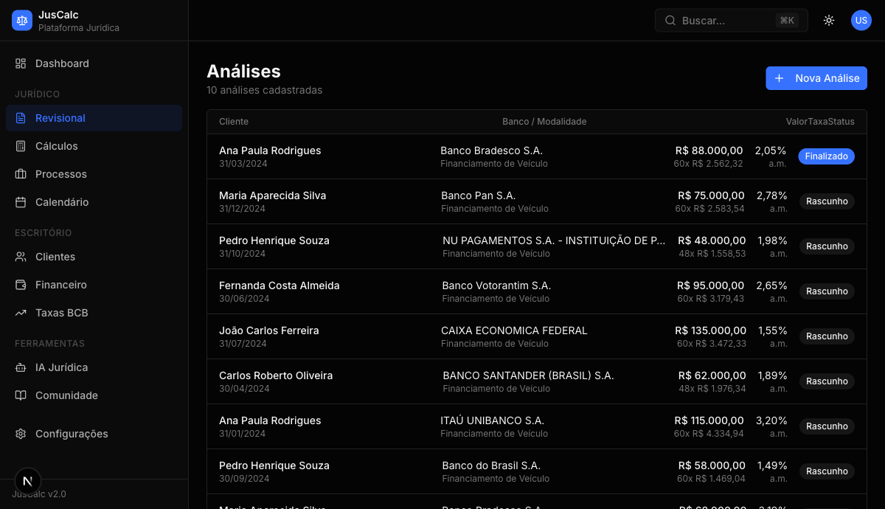
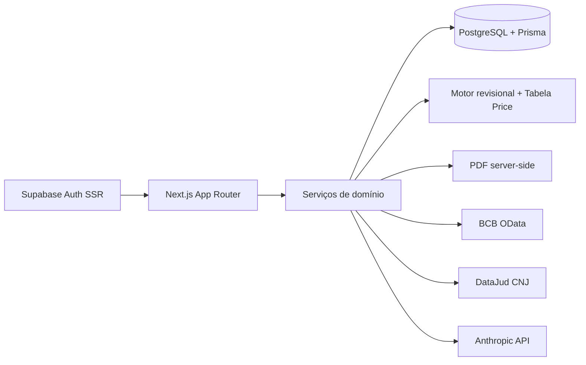

# JusCalc

Plataforma jurídica full-stack para revisão contratual bancária, cálculos especializados e gestão operacional de escritório.

[](https://nextjs.org/)
[](https://www.typescriptlang.org/)
[](https://www.prisma.io/)
[](https://supabase.com/)
[](https://pnpm.io/)
[](./LICENSE)

JusCalc nasceu com foco em produtividade jurídica de ponta a ponta. O núcleo do produto compara a taxa contratada em financiamentos com a média BACEN, aplica critérios jurisprudenciais do STJ, simula cenários revisionais com Tabela Price e gera laudos técnicos em PDF. Ao redor desse núcleo, o sistema também concentra clientes, processos, prazos, fluxo financeiro e ferramentas de IA jurídica em uma única interface.

## Por que esse repo é forte de portfólio

- Resolve um problema jurídico real com regra de negócio explícita, cálculo financeiro e fundamentação normativa.
- Mostra arquitetura full-stack moderna com Next.js App Router, Prisma, Supabase SSR, PWA e geração de PDF server-side.
- Vai além de CRUD: inclui motor de cenários, sincronização externa com BCB/DataJud e features de IA aplicada.
- Está estruturado para produto, não só para demo: multi-tenant, autenticação, CI, seed, convenções e documentação.

## Demonstração

| Dashboard | Revisional |
| --- | --- |
|  |  |

## Principais entregas do produto

- Revisional bancário com diagnóstico `NORMAL`, `ABOVE` e `ABUSIVE` com base em BACEN e STJ.
- Geração de 3 cenários automáticos: parâmetro BACEN, taxa fixa de 1,48% a.m. e limite de 1,5x da taxa média.
- Emissão de laudo técnico em PDF com memória de cálculo e conclusão jurídica.
- Dashboard com KPIs do escritório, listagens e atalhos operacionais.
- CRM jurídico básico para clientes, processos, movimentações, prazos e financeiro.
- Hub de IA jurídica para petições, análise documental e chat contextual.
- Sincronização de dados públicos via BACEN/BCB OData e DataJud/CNJ.
- Experiência web com dark mode, PWA e autenticação SSR com Supabase.

## Stack

| Camada | Tecnologias |
| --- | --- |
| Frontend | Next.js 16, React 19, TypeScript strict, Tailwind CSS 4, shadcn/ui |
| Backend | App Router, Route Handlers, Prisma 7, PostgreSQL, Supabase SSR |
| Produto | @react-pdf/renderer, next-pwa, Recharts, React Hook Form, Zod |
| Integrações | BACEN/BCB OData, DataJud (CNJ), Anthropic API |
| DX | pnpm, ESLint 9, GitHub Actions, seed de dados e documentação AI-native |

## Arquitetura em alto nível



Arquitetura detalhada em [docs/architecture.md](./docs/architecture.md).

## Domínio revisional

### Cenários gerados

| Enum | Descrição | Regra |
| --- | --- | --- |
| `BCB_AVERAGE` | Parâmetro BACEN | Taxa média do período |
| `FIXED_148` | Taxa fixa | 1,48% a.m. |
| `BCB_150` | Limite STJ | 1,5x a taxa BACEN |

### Diagnóstico automático

| Nível | Regra |
| --- | --- |
| `NORMAL` | taxa contratada <= taxa BACEN |
| `ABOVE` | taxa BACEN < taxa contratada <= 1,5x BACEN |
| `ABUSIVE` | taxa contratada > 1,5x BACEN |

## Rodando localmente

### 1. Pré-requisitos

- Node.js 20+
- pnpm 9+
- PostgreSQL local ou projeto Supabase

### 2. Instalação

```bash
pnpm install
cp .env.example .env.local
```

### 3. Configure as variáveis

Preencha os valores em `.env.local`:

```bash
DATABASE_URL=
NEXT_PUBLIC_SUPABASE_URL=
NEXT_PUBLIC_SUPABASE_ANON_KEY=
ANTHROPIC_API_KEY=
DATAJUD_API_KEY=
CRON_SECRET=
```

### 4. Prepare o banco

```bash
pnpm prisma:generate
pnpm prisma migrate dev
pnpm seed
```

### 5. Suba a aplicação

```bash
pnpm dev
```

Abra [http://localhost:3000](http://localhost:3000).

## Scripts úteis

| Comando | O que faz |
| --- | --- |
| `pnpm dev` | ambiente local |
| `pnpm build` | build de produção |
| `pnpm start` | sobe a build localmente |
| `pnpm lint` | roda ESLint no projeto |
| `pnpm typecheck` | valida TypeScript sem emitir arquivos |
| `pnpm check` | lint + typecheck |
| `pnpm prisma:generate` | gera o client Prisma |
| `pnpm db:push` | sincroniza schema com o banco |
| `pnpm seed` | popula o projeto com dados demo |

## Estrutura do projeto

```text
src/
  app/
    (auth)/               autenticação e onboarding
    (dashboard)/          produto principal
    api/                  rotas server-side
  components/             UI e blocos de domínio
  lib/                    cálculo, auth, integrações, utils
  services/               regras de aplicação e acesso a dados
prisma/
  migrations/             histórico do banco
  seed.ts                 base demo
docs/
  architecture.md         visão técnica do sistema
  images/                 screenshots do produto
```

## Qualidade do repositório

- CI no GitHub Actions com instalação, geração do client Prisma, lint, typecheck e build.
- `.env.example` e documentação de onboarding para reduzir atrito de setup.
- `AGENTS.md` e `CLAUDE.md` mantidos no repositório para orientar workflows de desenvolvimento assistido por IA.
- Seeds e screenshots de produto para tornar o repo demonstrável logo no primeiro clone.

## Documentação complementar

- [Arquitetura técnica](./docs/architecture.md)
- [Guia de contribuição](./CONTRIBUTING.md)

## Roadmap

- [x] Núcleo revisional com laudo técnico em PDF
- [x] CRM jurídico, processos, calendário e financeiro
- [x] Hub de IA jurídica
- [x] Sync de taxas BACEN e movimentos via DataJud
- [ ] Testes automatizados de domínio e integrações críticas
- [ ] Observabilidade e auditoria por tenant
- [ ] Deploy público com ambiente de demonstração

## Licença

MIT. Veja [LICENSE](./LICENSE).
