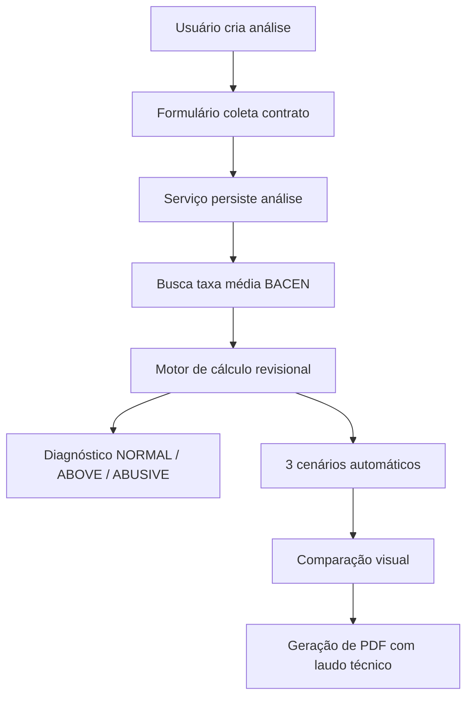

# Arquitetura do JusCalc

## Resumo

O JusCalc é uma aplicação web full-stack orientada a produto, com foco em revisão contratual bancária e operação de escritório jurídico. A arquitetura combina renderização híbrida com Next.js App Router, autenticação SSR com Supabase, persistência relacional com Prisma/PostgreSQL e integrações externas para enriquecer cálculo, processo e produtividade.

## Objetivos arquiteturais

- Centralizar operação jurídica, cálculo e gestão em uma única interface.
- Manter regras de negócio explícitas e reutilizáveis no servidor.
- Permitir evolução por módulos sem acoplar a aplicação em uma feature só.
- Favorecer DX com tipagem forte, seed de demo, CI e documentação.

## Blocos principais

| Bloco | Responsabilidade |
| --- | --- |
| `src/app` | páginas, layouts protegidos e route handlers |
| `src/components` | interface compartilhada, layout e blocos de domínio |
| `src/services` | casos de uso, queries e orchestration |
| `src/lib` | motor de cálculo, auth, integrações externas e utilitários |
| `prisma/schema.prisma` | modelo relacional e contratos de persistência |

## Fluxo principal: revisão contratual

### Regras de domínio relevantes

- A taxa contratada é comparada com a taxa média do BACEN no período da contratação.
- O limite de abusividade segue a lógica de `1,5x` da média BACEN, alinhada ao entendimento jurisprudencial do STJ.
- Os cenários são calculados com base em Tabela Price, redução de parcela, economia total e indébito estimado.
- Valores persistidos no banco usam `Decimal` do Prisma para evitar ruído de ponto flutuante.

## Módulos de produto

### Revisional

- Cadastro de contratos e clientes.
- Comparação BACEN versus taxa contratada.
- Cenários revisionais e laudo PDF.

### Operação do escritório

- Gestão de clientes.
- Cadastro de processos e prazos.
- Financeiro com lançamentos e visão de caixa.
- Calendário operacional.

### Ferramentas

- IA jurídica para petições, análise documental e chat contextual.
- Comunidade com posts e templates.

## Integrações externas

| Integração | Uso no produto |
| --- | --- |
| Supabase Auth | autenticação SSR e contexto de usuário |
| BACEN / OData | taxa média para cálculo revisional |
| DataJud / CNJ | sincronização de movimentações processuais |
| Anthropic API | features de IA jurídica |

## Modelo de dados

O schema Prisma é organizado em torno de `Organization`, que funciona como o contêiner do tenant. A partir dela, o sistema relaciona:

- `Member` para acesso e papel do usuário.
- `Client`, `Analysis` e `Scenario` para o núcleo revisional.
- `Process`, `Movement`, `Deadline` e `Document` para operação processual.
- `Finance` para lançamentos financeiros.
- `Calculation`, `Post` e `Template` para módulos auxiliares.

## Decisões que valem destacar em portfólio

- Multi-tenant simples e explícito via `organizationId`.
- Geração de PDF no servidor com template dedicado.
- Integrações encapsuladas em `lib/` e `services/` em vez de espalhadas pelas páginas.
- Seeds com dados realistas para demonstração rápida.
- Repositório preparado para desenvolvimento assistido por IA com `AGENTS.md` e `CLAUDE.md`.

## Próximos passos técnicos

- Cobertura de testes para motor revisional e integrações críticas.
- Auditoria por tenant e trilha de ações sensíveis.
- Feature flags para módulos opcionais do escritório.
- Observabilidade e monitoramento de jobs de sync.
